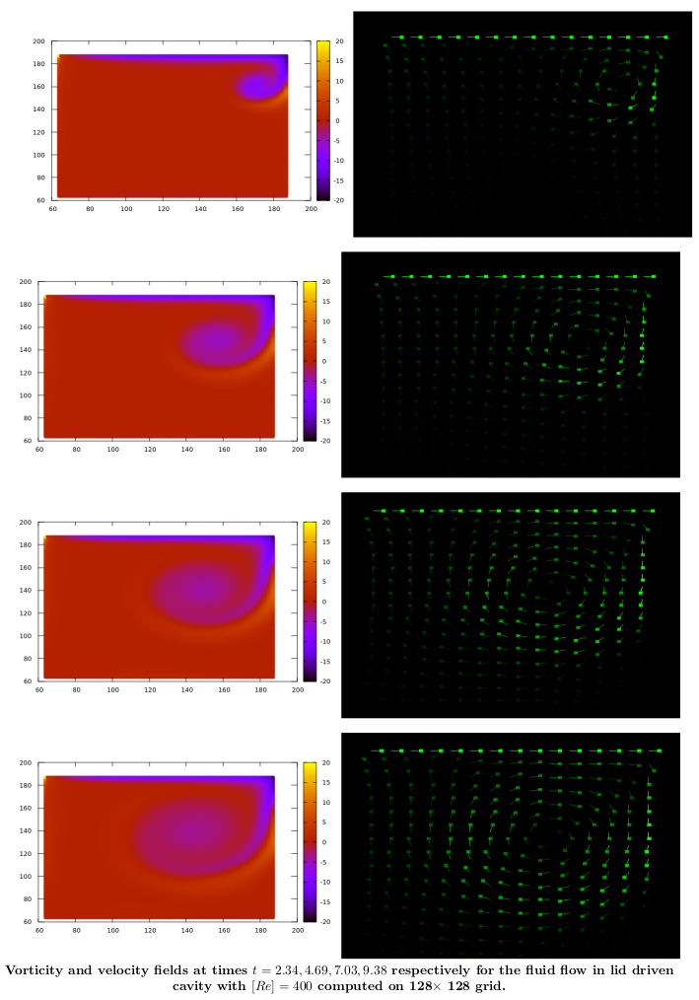
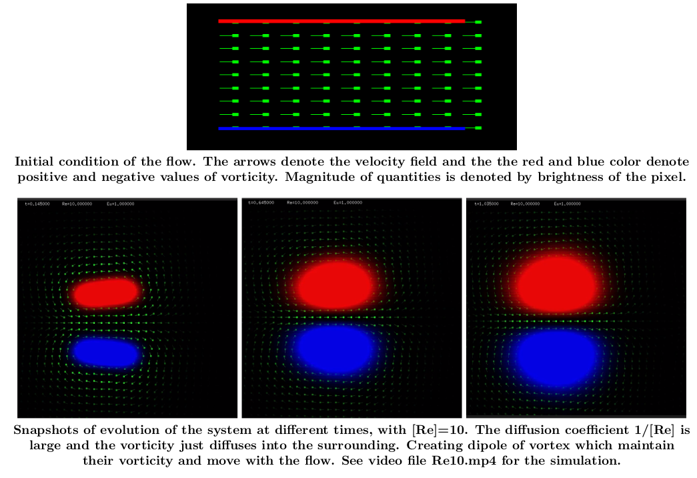
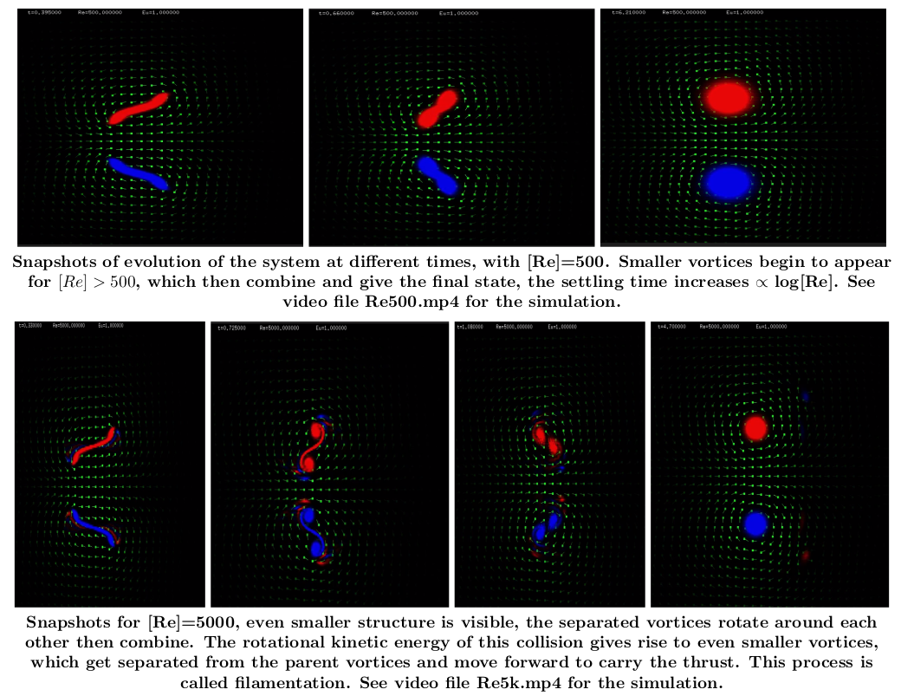
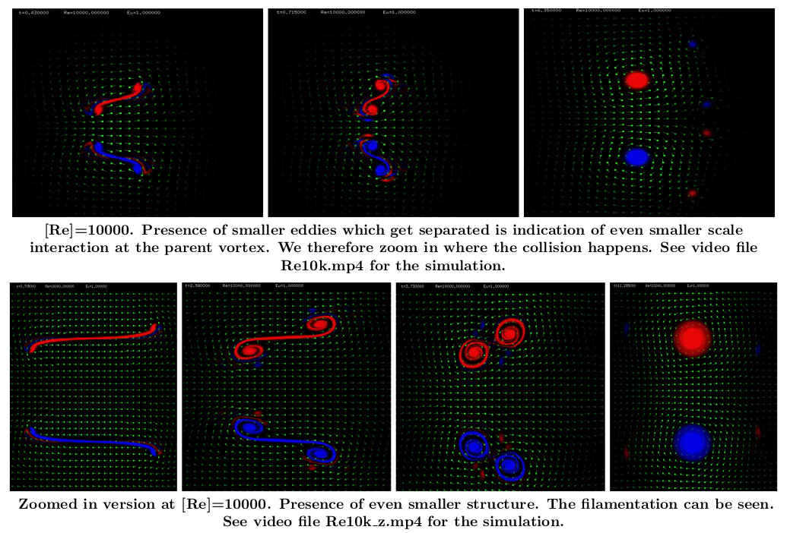
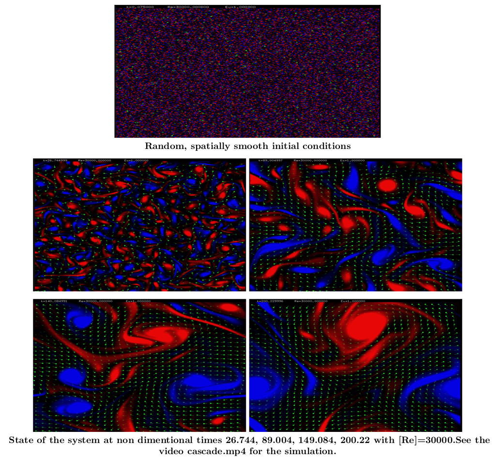

# Fluid_simulation
The code can Numerically solve of two dimentional Navier-Stokes fluid equations for compressible and incompressible flows using 
pressure corrector, and voritcity stream function approach. Some attached examples are

## + Lid driven Cavity flow.

## + Two dimentional vortices

## + Turbulent flow in two dimentions

Videos for all of the simulations can be found at the folliwing [link](https://www.youtube.com/watch?v=O6RVwUqRKgg&list=PLEsVP16ISIIfqyjLCz_KEWRjRfS9omDGU). Check out the file "report.pdf" in current repository for detailed report. 

